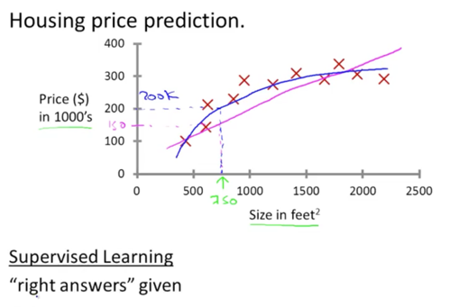
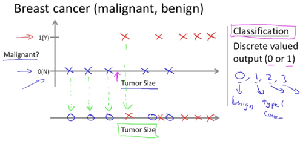
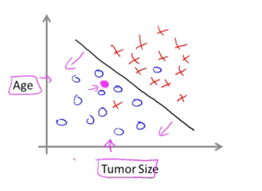

#Machine Learning
===============

##Table of Contents
=================
In progress table of contents.
* [Pandas](https://github.com/caromedellin/Python-notes/blob/master/pandas.pyc)
  <br> Imported Pandas to play with it.
* [Chapter 1: Reading from a CSV Pandas cookbook](http://nbviewer.ipython.org/github/jvns/pandas-cookbook/blob/master/cookbook/Chapter%201%20-%20Reading%20from%20a%20CSV.ipynb)
  <br> Reading your data into pandas is pretty much the easiest thing. Even when the encoding is wrong!

Compilation of notes from the Standford class given by Andrew Ng and other miscellaneous resources.

##What is Machine Learning? 
There are two main definitions of Machine Learning are offered. Arthur Samuel described it as: “the field of study that gives computers the ability to learn without being explicitly programmed (this is an older definition).
Tom Mitchell provides a more modern definition. “A computer is said to learn from experience E with respect to some class of tasks T and performance measure P, if its performance at tasks in T is measured by P, improves with experience E”.
```
Example: playing checkers.

E = the experience of playing many games of checkers
T = the task of playing checkers
P = the probability that the program will win the next game.
```
Machine Learning grew out of work in AI and it's a new capability for computers. Learning Algorithms can touch many problems. My personal interests are in Natural Language Processing, Database mining and self customizing programs.

As explained in the course by Andrew Ng, Machine Learning can be supervised and unsupervised.

## Supervised Learning

In supervised Learning we are given a data set and we already know what to expect from it, this means that we know what the correct output should look like. There is already an idea that there is a relationship between the input and the output.
The supervised learning problems are categorized in "regression" and "classification" problems
###Regression
In a regression problem we are trying to predict results within a continuous output, this means that we are trying to map input variables in to some continuous function.

####Example
Here we are given a dataset about the size of houses on the real estate market, with it we can try to predict their price. "The write answers" being given means that we have examples for which we know what the actual price given a condition (or a set of variables) actually is in the real world. Then with this knowledge there are different possible predictions or functions we can choose from, we want to minimize the cost function (square-error).



Supervised learning refers to the fact that e gave the algorithm a dataset in which for every example we told it what was the right price, and the toss of the algorithm was to produce more of the right answers. This is called a regression problem.  
Regression: refers to the fact that we try to predict it with continuous values attributes.

###Classification
In a classification problem we are trying to predict results within a discrete output, like yes or no, basically dividing in to categories (it can be more than 2).



Sometimes we have more than one attribute. 
Let’s say that instead of just knowing the tumor size we know the age and the tumor size and a different set of patients that look a little different have also some tumors. Given a data set like this what a learning algorithm would do is try to separate the tumor in classes with a class. 



There are learning algorithms that can deal with more than 2 features, for some learning problems what you want is an infinite number of attributes to use before that make predictions, how do you even store that. 

You store them as vector, imagine that you wrote an infinite amount of them. 
The regression problem and the goal is to predict a continuous value output 
classification problem goal is a discrete value output.

Example.
You are running a company and you want to develop learning algorithm to address each of two problems.

Problem1: You have a large inventory of identical items. You want to predict how many of these items will well over the next 3 motnhs.
Problem2: You’d like software to examine individual costumer accounts and for each account decide if it has been hacked/compromised

Should you treat there as classification or as a regression?

For problem one is a regression problem because you have so many problems you can keep it as a continuous value and the second problem is a classification problem because you can set the value of what you want to predict 0-1. Then you have an algorithm try to predict each of those discrete values.

Unsupervised learning:

Before data sets had examples that had a right answer or wrong data labels, in unsupervised data learning there are no labels, you basically ask the computer to ask some structure and make something out of it. 

Unsupervised learning, on the other hand, allows us to approach problems with little to no data where we won’t necessarily know the effect of the variables.
We can derive this structure by clustering the data based on relationships among the variables in the data. 
With unsupervised learning there is no feedback based on the prediction results, but it’s not only about clustering. For example, associative memory is unsupervised learning.
Example: 

Clustering: Take a collection of 1000 essays written on the US Economy, and find a way to automatically group these essays in to a small number that are somehow similar or rates by different variables, such as word frequency, sentence length, page count, and so on.

A costuming algorithm


What they do it's that it groups thing in to cohesive groups.
When you click one of the url you get a webpackage that is similar to another, they use it in Google and if you click on a different url and a third one what Google news does is that it looks an 10's of thousand of things. And it groups it together. 

You run a costuming algorithm to group individuals, instead what we are saying is here's a bunch of data, can you find structure of it. Because we are not giving it the right answer this is unsupervised learning, it's used to organize large computer cluster and try to figure out what machines work together. 
• Organize computing clusters
• Social network analysis
• Market segmentation
• Astronomical data analysis
Social network analysis, given your circles, can we automatically group which are cohesive groups of people, costumers and market segments. It's also used for automatic cluster analysis. 
Another, non-clustering example, is the “cocktail Party Algorithm” which can find structure in messy data-like identifying individual voices and music from a mesh of sounds ata cocktail party. 
#####Cocktail party problem.
  You put 2 microphones in the group and they record 2 combinations of this 2 speaker's voices. You are not sure whom you are recording. Sounds like 2 audio recorders that have been added together. So separating out the voices it's the end goal. 
  When you give these two microphone recorders the same algorithm it again cleans the audio sources, you might look at an unsupervised learning algorithm might be really complicated program to separate audio. But it turns out that it is done with a line of code. 
Octave, or mat-lab, many learning algorithm become just a few lines of code. Turns out in silicone valley you use octave. Lineal algebra routine. You can't implement it in C++ or Java.
For about a decade you learn much faster if you use octave you lean the algorithm much quicker. You use an algorithm in octave to get your algorithm much faster. For those who've never use this environment before, you development time is one of your must valuables resources. 
You become a lot more productive.

ML: Linear Regression with One Variable


Model Representation
Recall that in regression problems, we are taking input variables and trying to fit the output onto a continuous expected result function.

Linear regression with one variable is also known as ‘univariate linear regression’.

Univariate linear regression is used when you want to predict single learning here, so that means we already have an idea about what the input/output cause and effect should be. 

###Some Useful links
(https://github.com/estimate/pandas-exercises)


